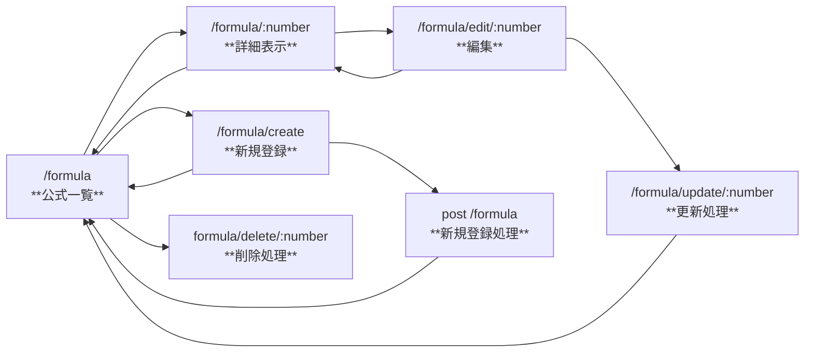

```mermaid
graph LR
    %% ノードの定義（わかりやすく先に定義します）
    List["/formula<br/>**公式一覧**"]
    Detail["/formula/:number<br/>**詳細表示**"]
    Edit["/formula/edit/:number<br/>**編集**"]
    Update["/formula/update/:number<br/>**更新処理**"]
    New["/formula/create<br/>**新規登録**"]
    Newedit["post /formula<br/>**新規登録処理**"]
    Delete["formula/delete/:number<br/>**削除処理**"]


    %% 遷移の定義
    List --> Detail
    Detail --> List
    Detail --> Edit
    Edit --> Detail
    Edit --> Update
    Update --> List
    List --> New
    New --> List
    New --> Newedit
    Newedit --> List
    List --> Delete
```

