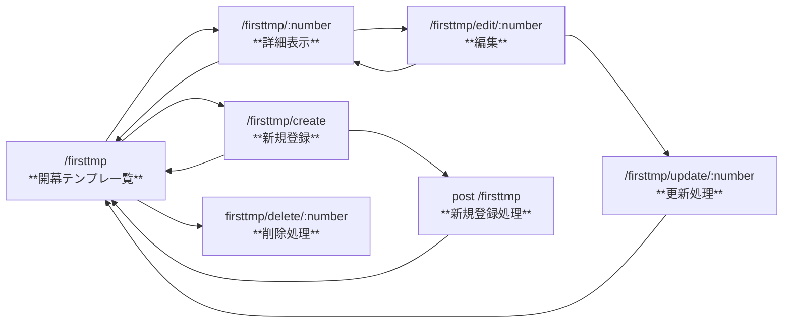

```mermaid
graph LR
    %% ノードの定義（わかりやすく先に定義します）
    List["/firsttmp<br/>**開幕テンプレ一覧**"]
    Detail["/firsttmp/:number<br/>**詳細表示**"]
    Edit["/firsttmp/edit/:number<br/>**編集**"]
    Update["/firsttmp/update/:number<br/>**更新処理**"]
    New["/firsttmp/create<br/>**新規登録**"]
    Newedit["post /firsttmp<br/>**新規登録処理**"]
    Delete["firsttmp/delete/:number<br/>**削除処理**"]


    %% 遷移の定義
    List --> Detail
    Detail --> List
    Detail --> Edit
    Edit --> Detail
    Edit --> Update
    Update --> List
    List --> New
    New --> List
    New --> Newedit
    Newedit --> List
    List --> Delete
```