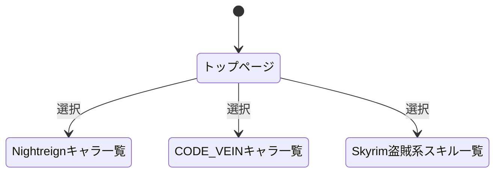
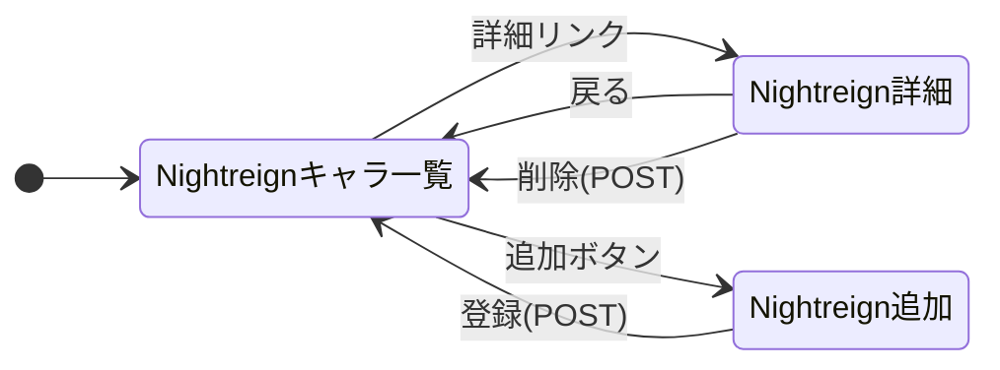
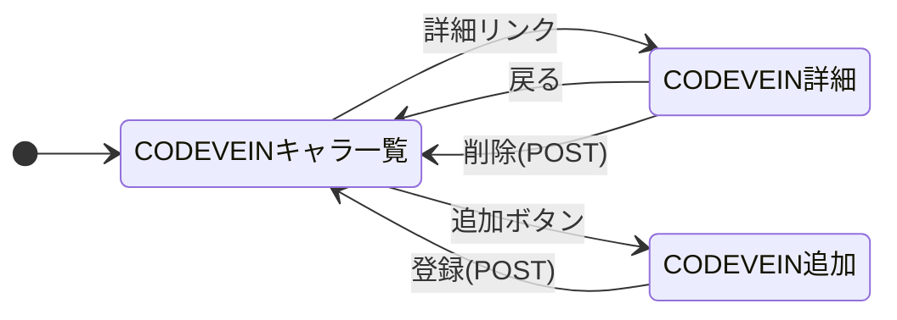
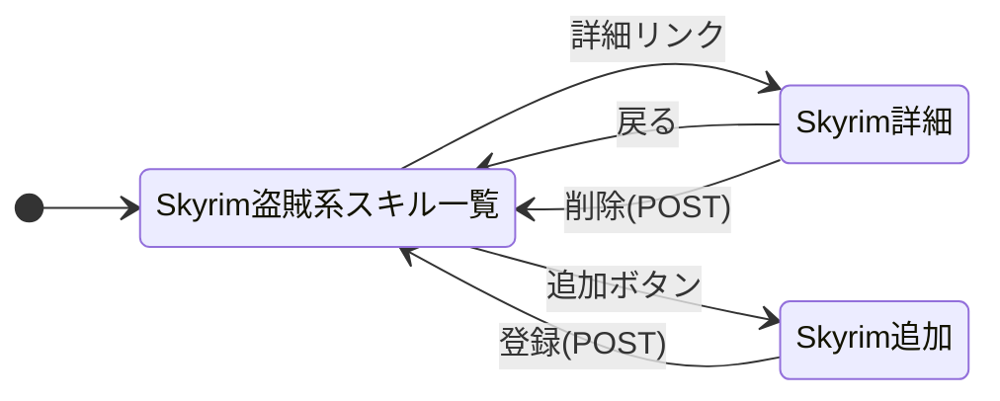

# ゲームデータ管理システムの仕様書

## 1. 目的と概要
本システムは，ゲーム「Nightreign」および「CODE VEIN」のキャラクター情報，ならびに「Skyrim」の盗賊系スキル情報を一元管理することを目的としたWebアプリケーションである．
ユーザーはブラウザを通じて，これら3つの異なるカテゴリのデータを閲覧，追加，削除することができる．これにより，複数のゲームに関する情報を効率的に整理・参照することが可能となる．

## 2. システムの概要
本システムの画面遷移と処理の流れを以下に示す．

### (1) 全体の階層構造
トップページから各ゲーム機能を選択して移動する．

##　(2) 各機能の詳細な画面遷移
各機能における画面遷移（一覧，詳細，追加，削除の流れ）を以下に示す．

###　(2.1)Nightreignの機能

###　(2.2)CODEVEINの機能

###　(2.3)Skyrimの機能

## 3. データ構造
本システムで扱うデータの形式（JSON）を以下に示す．3種類のデータはそれぞれ個別の配列として管理される．

### (1) Nightreign キャラクターデータ
[
  {
    "id": 1,
    "name": "[キャラ名]",
    "role": "[役割や得意武器など]",
    "description": "[詳細説明]"
  }
]

### (2) CODEVEIN キャラクターデータ
[
  {
    "id": 1,
    "name": "[キャラ名]",
    "type": "[バディ/NPC/敵など]",
    "description": "[詳細説明]"
  }
]
### (3) Skyrim 盗賊系スキルデータ
[
  {
    "id": 1,
    "name": "[スキル名]",
    "effect": "[効果の説明]",
    "level": "[習得可能レベル]"
  }
]

